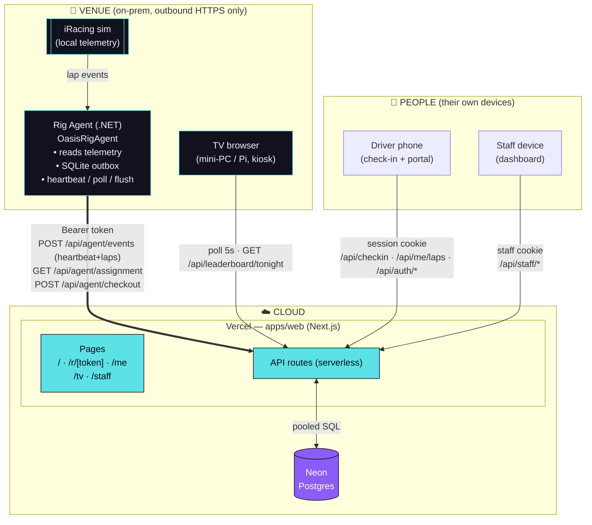

# Oasis Race Control — system architecture

How the pieces fit together and talk to each other. Three physically separate
tiers — **cloud** (Vercel + Neon), the **venue** (sim PCs + displays), and the
**people** using it — connected only by outbound HTTPS.

## Diagram



## ASCII fallback

```text
        PEOPLE (own devices)                 CLOUD
   ┌───────────────┐                 ┌──────────────────────────┐
   │ Driver phone  │──session cookie─▶│  Vercel  (apps/web)      │
   │  /r/[token]   │  /api/checkin    │  ┌────────────────────┐  │
   │  /me          │  /api/me/laps    │  │ Pages  /  /me  /tv │  │
   └───────────────┘  /api/auth/*     │  │        /r  /staff  │  │
   ┌───────────────┐                  │  ├────────────────────┤  │
   │ Staff device  │──staff cookie───▶│  │ API routes         │  │
   │  /staff       │  /api/staff/*    │  │ (serverless funcs) │  │
   └───────────────┘                  │  └─────────┬──────────┘  │
                                      │            │ pooled SQL  │
        VENUE (on-prem)               │       ┌────▼─────┐       │
   ┌───────────────┐                  │       │  Neon    │       │
   │ TV browser    │──poll 5s────────▶│       │ Postgres │       │
   │  /tv          │ /api/leaderboard │       └──────────┘       │
   └───────────────┘                  └──────────────▲───────────┘
   ┌───────────────┐   Bearer token, outbound 443    │
   │ iRacing sim   │        ┌──────────────┐          │
   │  (telemetry)  │──laps─▶│ Rig Agent    │──────────┘
   └───────────────┘        │ .NET + SQLite│  POST /api/agent/events
                            │ outbox       │  GET  /api/agent/assignment
                            └──────────────┘  POST /api/agent/checkout
```

## Who calls what

| Actor | Auth | Endpoints | Cadence |
|---|---|---|---|
| **Rig Agent** | Bearer (rig token) | `POST /api/agent/events` (heartbeat + laps), `GET /api/agent/assignment`, `POST /api/agent/checkout` | heartbeat 30s · poll 10s · flush 5s |
| **TV browser** | none (public) | `GET /api/leaderboard/tonight` | poll 5s |
| **Driver** | session cookie (JWT) | `/api/auth/{guest,login,register,logout,claim}`, `POST /api/checkin`, `GET /api/me/laps`, `POST /api/session/end` | on action · portal polls laps 5s |
| **Staff** | staff session cookie | `POST /api/staff/{login,logout,clear-rig,lap-validity,reset-pin}` | on action · dashboard refreshes 15s |

## Key properties

- **Only outbound connectivity at the venue.** The agent and TV both *call out*
  to Vercel over 443 — no inbound ports, no static IP, no firewall holes.
- **Everything is polling, not push.** Deliberate: no websockets to keep warm,
  so serverless cold starts are harmless and the whole app fits on Vercel.
- **The agent is the only durable buffer.** Laps land in its SQLite outbox the
  instant they're detected and are removed only once the backend accepts them,
  so a wifi drop or agent restart never loses a lap (idempotent on `event_id`).
- **The database enforces the core invariant.** A partial unique index
  (`one_open_assignment_per_rig`) guarantees at most one open assignment per rig
  even under concurrent check-ins — the app doesn't have to.
- **Auth is split by actor.** Rig agents use static bearer tokens; drivers and
  staff use separate signed-cookie sessions. No actor can act outside its scope.

## Where each piece is hosted

| Piece | Home | Notes |
|---|---|---|
| `apps/web` (Next.js) | **Vercel** | root dir `apps/web`; env `DATABASE_URL` (pooled) + `SESSION_SECRET` |
| Postgres | **Neon** | serverless; pooled connection string |
| `apps/rig-agent` | **each sim PC** | published single-file exe; auto-start via Task Scheduler |
| TV board | **venue display** | any always-on browser pointed at `/tv` in kiosk mode |
```
