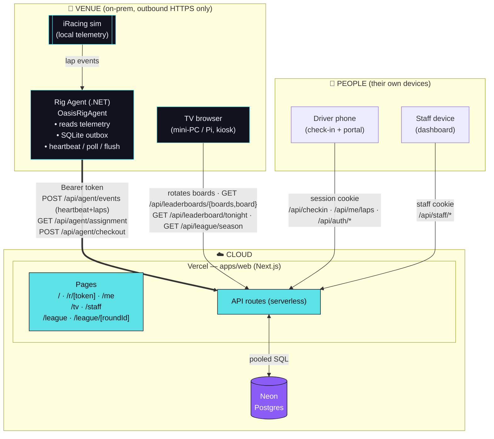

# Oasis Race Control — system architecture

How the pieces fit together and talk to each other. Three physically separate
tiers — **cloud** (Vercel + Neon), the **venue** (sim PCs + displays), and the
**people** using it — connected only by outbound HTTPS.

## Diagram


```mermaid
flowchart TB
    subgraph venue["🏢 VENUE (on-prem, outbound HTTPS only)"]
        direction TB
        iracing[["iRacing sim<br/>(local telemetry)"]]
        agent["Rig Agent (.NET)<br/>OasisRigAgent<br/>• reads telemetry<br/>• SQLite outbox<br/>• heartbeat / poll / flush"]
        tv["TV browser<br/>(mini-PC / Pi, kiosk)"]
        iracing -->|"lap events"| agent
    end

    subgraph people["👤 PEOPLE (their own devices)"]
        direction TB
        driver["Driver phone<br/>(check-in + portal)"]
        staff["Staff device<br/>(dashboard)"]
    end

    subgraph cloud["☁️ CLOUD"]
        direction TB
        subgraph vercel["Vercel — apps/web (Next.js)"]
            pages["Pages<br/>/ · /r/[token] · /me<br/>/tv · /staff<br/>/league · /league/[roundId]"]
            api["API routes (serverless)"]
        end
        neon[("Neon<br/>Postgres")]
        api <-->|"pooled SQL"| neon
    end

    agent ==>|"Bearer token<br/>POST /api/agent/events (heartbeat+laps)<br/>GET /api/agent/assignment<br/>POST /api/agent/checkout"| api
    tv -->|"rotates boards · GET /api/leaderboards/{boards,board}<br/>GET /api/leaderboard/tonight · GET /api/league/season"| api
    driver -->|"session cookie<br/>/api/checkin · /api/me/laps · /api/auth/*"| api
    staff -->|"staff cookie<br/>/api/staff/*"| api

    classDef cloudcls fill:#5ce1e6,stroke:#0a0a14,color:#0a0a14;
    classDef db fill:#8b5cf6,stroke:#0a0a14,color:#fff;
    classDef venuecls fill:#12121f,stroke:#5ce1e6,color:#f2f2fa;
    class api,pages cloudcls;
    class neon db;
    class agent,tv,iracing venuecls;
```

## ASCII fallback

```text
        PEOPLE (own devices)                 CLOUD
   ┌───────────────┐                 ┌──────────────────────────┐
   │ Driver phone  │──session cookie─▶│  Vercel  (apps/web)      │
   │  /r/[token]   │  /api/checkin    │  ┌────────────────────┐  │
   │  /me          │  /api/me/laps    │  │ Pages / /me /tv /r │  │
   └───────────────┘  /api/auth/*     │  │  /staff  /league   │  │
                                      │  │  /league/[roundId] │  │
   ┌───────────────┐                  │  ├────────────────────┤  │
   │ Staff device  │──staff cookie───▶│  │ API routes         │  │
   │  /staff       │  /api/staff/*    │  │ (serverless funcs) │  │
   └───────────────┘                  │  └─────────┬──────────┘  │
                                      │            │ pooled SQL  │
        VENUE (on-prem)               │       ┌────▼─────┐       │
   ┌───────────────┐                  │       │  Neon    │       │
   │ TV browser    │──rotates boards─▶│       │ Postgres │       │
   │  /tv          │ /api/leaderboard*│       └──────────┘       │
   └───────────────┘                  └──────────────▲───────────┘
   ┌───────────────┐   Bearer token, outbound 443    │
   │ iRacing sim   │        ┌──────────────┐          │
   │  (telemetry)  │──laps─▶│ Rig Agent    │──────────┘
   └───────────────┘        │ .NET + SQLite│  POST /api/agent/events
                            │ outbox       │  GET  /api/agent/assignment
                            └──────────────┘  POST /api/agent/checkout
```

## Who calls what

| Actor | Auth | Endpoints | Cadence |
|---|---|---|---|
| **Rig Agent** | Bearer (rig token) | `POST /api/agent/events` (heartbeat + laps), `GET /api/agent/assignment`, `POST /api/agent/checkout` | heartbeat 30s · poll 10s · flush 5s |
| **TV browser** | none (public) | `GET /api/leaderboards/boards`, `GET /api/leaderboards/board`, `GET /api/leaderboard/tonight`, `GET /api/league/season` | board rotates 15s · on-screen board refreshes 5s · board list 120s · the league board holds the screen while a round is open |
| **Driver** | session cookie (JWT) | `/api/auth/{guest,login,register,logout,claim}`, `POST /api/checkin`, `GET /api/me/laps`, `POST /api/session/end` | on action · portal polls laps 5s |
| **League board / round page** | none (public) | `GET /api/league/season`, `GET /api/league/rounds/[roundId]` | standings poll 10s · open round poll 6s (a closed round never polls) |
| **Staff** | staff session cookie | `POST /api/staff/{login,logout,clear-rig,lap-validity,reset-pin}`, `POST /api/staff/league/{open-round,close-round,roll-season}` | on action · dashboard refreshes 15s |
| **Kubernetes probes** | none (public) | `GET /api/health` (liveness: the process is up; touches nothing), `GET /api/ready` (readiness: one `select 1` through the pool under a 2s deadline; 503 with a plain-English `reason` when the database does not answer) | on the probe periods the manifests set, every replica |

## Key properties

- **Only outbound connectivity at the venue.** The agent and TV both *call out*
  to Vercel over 443 — no inbound ports, no static IP, no firewall holes.
- **Reads poll; the agent pushes over plain HTTPS.** UI and cloud-to-venue
  read/update flows poll on a timer, and the agent ships laps with outbound
  `POST /api/agent/events` — no websockets to keep warm either way, so
  serverless cold starts are harmless and the whole app fits on Vercel.
- **The agent is the only durable buffer.** Laps land in its SQLite outbox the
  instant they're detected and are removed only once the backend accepts them,
  so a wifi drop or agent restart never loses a lap (idempotent on `event_id`).
- **The agent decides who owns a lap, at the moment it captures it.** Each
  queued lap carries the `rigAssignmentId` the rig had right then, and that
  stamp is the only thing the backend will attribute from. It is a capture-time
  attribution *candidate* rather than a verdict: the backend still checks that
  the assignment belongs to the calling rig and that the lap's `completedAt`
  falls inside that assignment's window (plus a clock-skew grace), and stores
  the lap `accepted_unattributed` when either check fails. What it will not do
  is substitute a different owner. It is the buffer above that makes
  this necessary: a lap can arrive long after its driver has left, so "whoever
  is checked in when the batch lands" is a different person. See the event model
  in `docs/plan.md` for the three states of the stamp.
- **Switching driver empties the seat whether or not the backend hears it.** The
  agent clears its own assignment the moment the button is pressed and queues
  the checkout durably, so a press the venue link swallowed still stops the next
  person's laps being stamped with the departed driver. Until the queued
  checkout lands, laps on that rig carry no owner and arrive `accepted_unattributed` -
  unclaimed on `/staff`, where staff already work them, rather than credited
  to somebody who has gone home. The queued checkout names the assignment it is
  ending (`POST /api/agent/checkout`), which is what makes it safe to re-send
  once the seat may belong to somebody else.
- **The database enforces the core invariant.** A partial unique index
  (`one_open_assignment_per_rig`) guarantees at most one open assignment per rig
  even under concurrent check-ins — the app doesn't have to. League night gets
  the same treatment: `one_open_round_venue_wide` keeps at most one round open
  across the venue, which is what makes "the lap that just landed belongs to
  tonight's round" unambiguous.
- **League rounds own laps by window and combo, not by a foreign key.** Laps
  carry no round id, so ingestion is unchanged; the rule and its rationale live
  once in the `v_league_round_laps` view (introduced in
  `db/migrations/0002_league_night.sql`; current definition in
  `db/migrations/0003_unattributed_laps.sql`, which also excludes unattributed
  laps from every round).
- **Unattributed laps are unrankable by constraint, not by convention.** The
  `laps_unattributed_is_invalid` check in `db/migrations/0003_unattributed_laps.sql`
  makes a valid ownerless lap unrepresentable, so no leaderboard query, staff
  "restore", or future consumer can surface one. That is a different guarantee
  from the view predicate above and neither replaces the other: the constraint
  governs whether an ownerless lap can ever be *valid*, while the view governs
  whether it is a member of a round at all - and `v_league_round_laps` exposes
  `is_valid` rather than filtering on it, so without its own predicate an
  ownerless row would still appear there. The same discipline covers *why*:
  `laps_unattributed_has_cause` (`db/migrations/0004_unattributed_cause.sql`)
  requires every ownerless lap to carry an `unattributed_cause` and forbids one
  on an owned lap, which is what lets `/staff` say per row whether the customer
  drove before scanning or a rig needs attention.
- **Auth is split by actor.** Rig agents use static bearer tokens; drivers and
  staff use separate signed-cookie sessions. No actor can act outside its scope.

## Where each piece is hosted

| Piece | Home | Notes |
|---|---|---|
| `apps/web` (Next.js) | **Vercel** | root dir `apps/web`; env `DATABASE_URL` (pooled) + `SESSION_SECRET` |
| Postgres | **Neon** | serverless; pooled connection string |
| `apps/rig-agent` | **each sim PC** | published single-file exe; auto-start via Task Scheduler |
| TV board | **venue display** | any always-on browser pointed at `/tv` in kiosk mode; unattended - it cycles every track board and recovers from feed failures without a reload |

`apps/web` also runs on a local Kubernetes cluster for development and for
demonstrating its runtime behaviour - two replicas, probes, rolling updates,
self-healing - with a development-only Postgres and the fake-rig simulator
standing in for Neon and the sim PCs. It hosts nothing and changes none of the
above: [platform/local-kubernetes.md](./platform/local-kubernetes.md).

The rig agent is deliberately absent from it. It is .NET win-x64, reads
iRacing's shared memory on the simulator's own machine, and is *installed*
rather than deployed; there is no Linux container that could run it.

