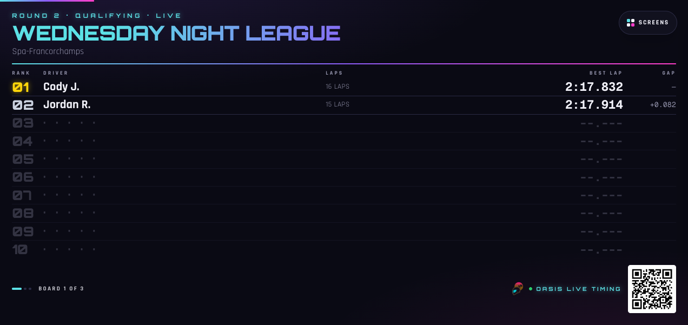
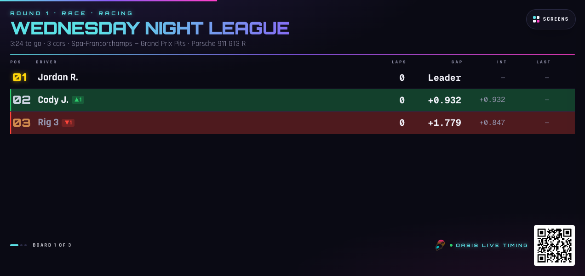
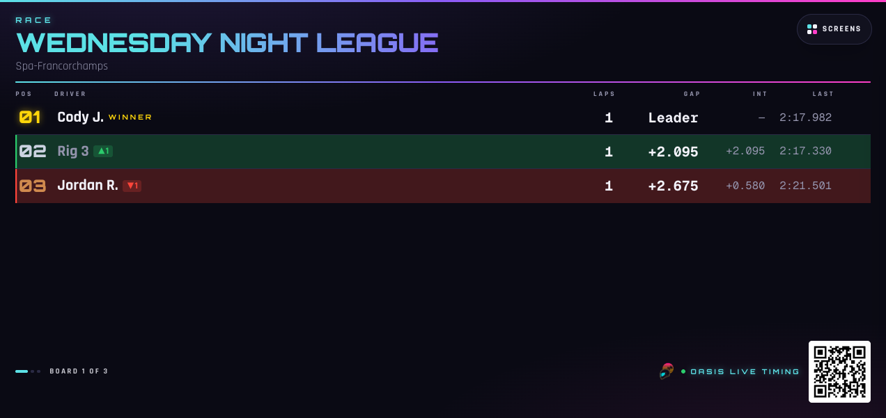
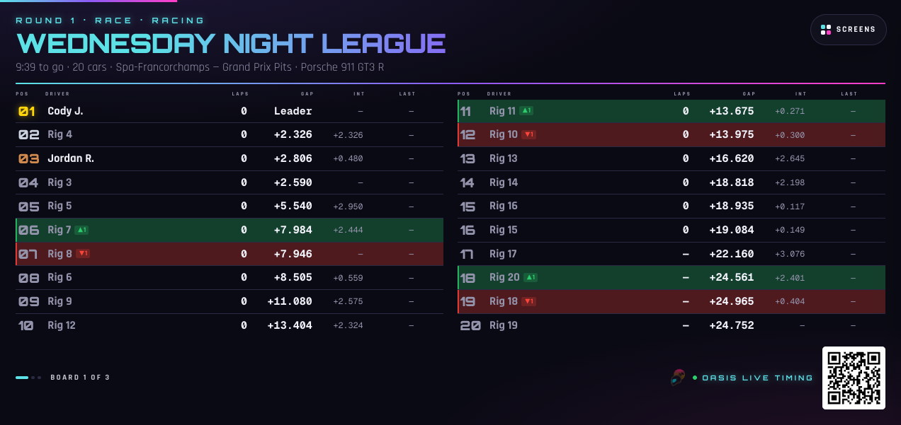
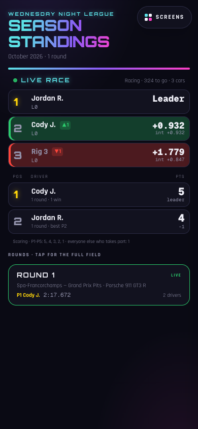
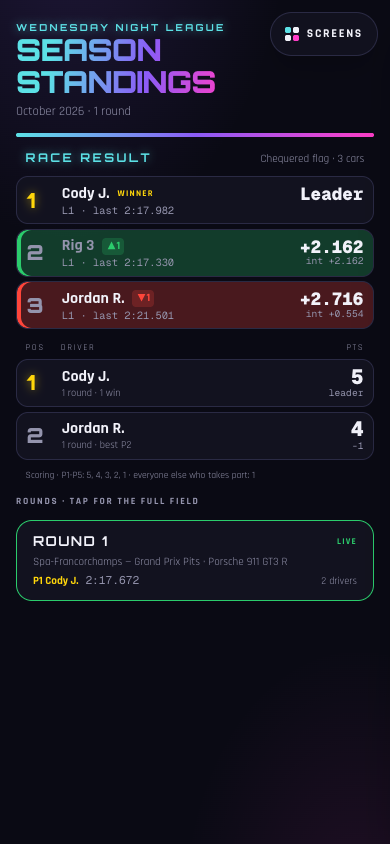

# The live race feed

League night ends in a race: every rig in one hosted iRacing session. The race
board shows the running order as it changes, within a few seconds of a pass on
track. This document covers the server half: what a rig reports, what the
server keeps, and what the public feed returns - and then, briefly, the two
screens that draw it ([the board](#the-board)).

```
rig agent ── POST /api/agent/race-status (every 2-3 s, its own car) ──▶ rig_race_status
                                                                        (one row per rig)
board / phone ◀── GET /api/race/live (rows heard in the last 60 s, one race, in order)
```

Each rig reports only **its own car**. The server joins that row to whoever is
checked in on the rig, the same assignment that owns the rig's laps, so the
board needs no mapping from iRacing accounts to people. The cost is that a car
driven from a PC without the agent does not appear. That is acceptable for a
league race, where every car is a venue rig.

## What a rig reports

The contract is `raceStatusEvent` in
[`apps/web/src/lib/events.ts`](../apps/web/src/lib/events.ts). That file is the
single source: its bounds, its null rules and the doc comment on it are the
contract, and this page only summarises them. The agent and
`apps/web/scripts/fake-rig.ts` are its producers. Change all three together.

| Field | iRacing source | Null when |
|---|---|---|
| `sampledAt` | the rig's clock at the read | never |
| `sessionUniqueId`, `sessionNum` | `SessionUniqueID`, `SessionNum` | never |
| `sessionType` | `SessionInfo.Sessions[SessionNum].SessionType` | not yet read |
| `sessionState`, `sessionFlags` | `SessionState` (0-6), `SessionFlags` (unsigned 32-bit) | never |
| `sessionTimeRemainS`, `sessionLapsRemain` | `SessionTimeRemain`, `SessionLapsRemainEx` | the session is unlimited (iRacing's 604800 s / 32767 laps) |
| `carIdx` | `PlayerCarIdx` | never |
| `position`, `classPosition` | `PlayerCarPosition`, `PlayerCarClassPosition` | iRacing reports 0 (not classified yet) |
| `lap`, `lapsCompleted`, `lapDistPct` | `Lap`, `LapCompleted`, `LapDistPct` | negative (not in the world) |
| `gapToLeaderS` | `CarIdxF2Time[PlayerCarIdx]` | not available |
| `lastLapMs`, `bestLapMs` | `CarIdxLastLapTime` / `CarIdxBestLapTime` `[PlayerCarIdx]`, in ms | iRacing reports 0 or -1 (no lap yet) |
| `onPitRoad` | `OnPitRoad` | never |
| `incidents` | `PlayerCarMyIncidentCount` | never |

How the agent sends it:

- **Only while iRacing is in a session**, every 2-3 s. It may skip a report
  identical to the last one, but never for more than 10 s. The feed marks a rig
  stale after 15 s and drops it after 60 s, so a parked car that goes quiet
  looks like a dead rig.
- **One report in flight, nothing kept.** A report that fails is dropped and
  the next sample goes out. There is no outbox and no retry, because an old
  position is worth nothing. This is why it has its own route and does not go
  through `/api/agent/events`.
- **Clamp before sending.** The body is validated whole, so one field out of
  bounds gets the report a 400 and the car disappears from the board.
- `POST /api/agent/race-status` with the rig's bearer token and the JSON object
  as the body (no `events` wrapper). The answer is **200 with an empty body**.
  A 400 carries zod's `detail` for the rig's log. 401 means the token is wrong.
  413 means the body is over 4 KiB. A 500 is dropped like any other failure.

The server keeps the report the rig's clock calls **newest**, by `sampledAt`,
not whichever arrived last: a request abandoned on a timeout that lands after
its successor would otherwise rewind the car, or put it back in the session it
just left, until the next report. The rig's clock only ever decides between
reports, though. Once the stored row has gone unreplaced past the 15 s stale
mark, any report replaces it, so a rig whose clock steps backwards is dimmed
for at most that long rather than frozen until its clock catches up and then
dropped off the board. A refused report still answers 200: it was valid, only
late.

## What the feed returns

`GET /api/race/live` is public, like the other feeds. The rules live in
[`apps/web/src/lib/race-live.ts`](../apps/web/src/lib/race-live.ts) and are
unit-tested there:

- It reads rows **received in the last 60 s**, judged by the database clock.
- It groups them by **session**: `SessionUniqueID` together with `SessionNum`.
  The **largest group is the race**. A tie goes to the group heard from most
  recently. `otherRigs` counts the rigs reporting from anywhere else, such as a
  rig still in practice or one that joined the wrong server.
- In a **race under green** (`SessionState` racing, as the leader's report
  reads it) it orders by how far round each car is: `lapsCompleted`,
  then `lapDistPct`, with iRacing's position only breaking a tie. iRacing's
  position moves only when a car crosses the line, so ordering by it would
  hold a pass made mid-lap off the board for up to a lap. Everywhere else -
  any other session, and a race on the grid, the parade lap or after the
  chequered flag - it orders by iRacing's **position**, and a car iRacing has
  not classified yet goes after every classified car, by how far round it is.
  After the flag that is the finishing order: a winner who slows, pits or
  leaves the car would otherwise fall behind cars still driving round.
  `session.byTrack` says which order `rows` are in.
- `session` is the leader's report: type, state, flags, time and laps
  remaining. The leader is the first car still reporting in iRacing's
  position order, so a silent leader's frozen clock is never shown. `isRace` is true when any rig in the
  group reads the session type as exactly `Race`.
- `gapToLeaderS` and `intervalS` are only filled in a race. Outside one,
  iRacing puts a lap time in the same variable. `intervalS` is the gap to the
  row above, rounded to the millisecond and never negative. It is null for the
  leader, and null to or from a stale car.
- `ageS` is how long ago each rig's report arrived. `stale` is true past 15 s:
  show that row dimmed. Under green a stale car stays where its last report put
  it on track, and any car still reporting that gets further round goes ahead
  of it. Otherwise it keeps its last position, because usually only its
  agent stopped while the car is still out there; if another car reports that
  same position, the car still reporting goes first.
- `driverId` and `driverName` come from whoever is checked in on the rig right
  now. With nobody checked in, or with a driver who is not `active` (hidden
  from the leaderboards too), they are null, and the board shows the rig by
  `rigNumber`.

**Number the board by `place`, not `position`.** `place` is the row's number
in this ordering, from 1, and never repeats. In a race under green it is the
running order on track, so a pass shows at the next report from each car,
while iRacing's position for both cars still reads as it did at the line until
each crosses it. Otherwise two neighbours can report the same position for up to one
cadence, because each rig samples its own car at its own instant, and `place`
puts them in order.

Latency is the rig's cadence (2-3 s), plus the request, plus however often the
board polls. That is fast enough for a wall, but it is not a timing screen.

## The board

Two screens read the feed, and they are one screen drawn twice: the wall's
league board (`apps/web/src/components/tv/board-types.tsx`, drawing
`tv/race-board.tsx`) and the panel at the top of `/league`
(`components/live-race-panel.tsx`). While tonight's league round is open
(`isOpenTonight` in `apps/web/src/lib/league.ts`), both poll the feed every 2.5 s through
`components/use-live-race.ts`, and every rule about *what* is shown lives in
`apps/web/src/lib/race-board.ts`, pure and unit-tested, so the wall and the
phone agree by construction:

- The race replaces the standings when **tonight's league round is open** and
  the feed reports a **`Race` session with at least two rigs**, from the grid
  onwards. One rig in a race session is a test drive and shows nothing, and a
  race with no round open is not league night: neither screen shows it, the
  wall keeps rotating, and neither asks the feed.
- Rows are numbered by `place`. A row that just changed place flashes once
  (green up, red down) and carries ▲n / ▼n beside the name for a few seconds.
  A `stale` rig is dimmed where it was; a rig with nobody signed in reads
  `Rig N` in the muted colour; a car on pit road carries a PIT chip. On the
  wall the header says only "Race", then the track and nothing else, under
  green and under the flag: the owner asked for no round number, session
  state, layout, car, car count, or time or laps left up there, since the room
  knows the combo and the order shows the field. The phone panel keeps the
  session's state, the time or laps left, and the car count.
- After the chequered flag the **finishing order stays up for one minute**,
  counted from the first report that showed the flag, still updating as cars
  cross the line, then the standings come back even if the rigs are still
  reporting the flag. The finish is remembered per session, so that race does
  not return; the next race is a new session and shows at once.
- A feed that stops answering keeps the race on screen only as long as the
  feed would keep a silent rig (60 s), so a dead feed cannot freeze a race on
  the wall.

On the wall this is the third screen of the league board, which already takes
the wall over while tonight's round is open: season standings on an ordinary
day, the round's qualifying ranking (fastest valid lap, the same ranking as
`/league/[roundId]`) while the round is open, and the race on top of that.
It is one board, not a second one, because the rotation engine's hold is a
max over the slide on screen - a separate race slide would never be reached
while the league board holds (`CLAUDE.md`, The `/tv` board rotation). Past
ten cars the race table is drawn as two halves at three quarters of the size,
so a twenty-car field fits the venue's 1272x601 wall; the sizing rules are
the ones every `/tv` board follows.

As the fake rigs drive it, at the wall's 1272x601 and a 390px phone:

| Qualifying (round open, no race) | Race, a pass just made |
|---|---|
|  |  |

| Chequered flag, held for a minute | Twenty cars |
|---|---|
|  |  |

| `/league` during the race | `/league` after the flag |
|---|---|
|  |  |

## Seeing it locally

The dev seed has three rigs. Check a driver in on two of them, at
`/r/demo-rig-1` and `/r/demo-rig-2` as in the root README's demo, and leave the
third empty so that both the driver join and the bare rig number show. Then
start three fake rigs in race mode. They compute the same race from the clock and each
reports its own car (`apps/web/scripts/fake-race.ts`):

```bash
cd apps/web
npm run fake-rig -- --token dev-rig-1-secret --race --car 0 --field 3
npm run fake-rig -- --token dev-rig-2-secret --race --car 1 --field 3
npm run fake-rig -- --token dev-rig-3-secret --race --car 2 --field 3
curl -s localhost:3000/api/race/live
```

Neighbours trade places on track every 20-40 s. As in iRacing, each fake
car's `position` only changes when it crosses the line, so the feed's order
leads it mid-lap. Each race lasts `--race-minutes`
(default 20), ends with a minute under the chequered flag, and the next race is
a new session. Stop one rig to watch its row go stale and then drop out. With a
round open on `/staff`, `/tv` switches from the round's qualifying ranking to
the race order within a poll, and `/league` grows the same panel; `--race-start`
set to now and `--race-minutes 4` is a quick way to watch a whole race, the
minute under the flag, and the board handing the wall back.

`npm run` only passes the flags on after the `--`. Under the twenty-rig
soak, `--race` drives one simulated race across every rig and checks the feed
once at the end of the hold ([soak-20-rigs.md](soak-20-rigs.md#running-it)).

## Not settled yet

- Nothing has read these variables on a real rig. Before the board is trusted,
  the agent's `--diagnose` must show, in a hosted session with at least two
  rigs: `SessionUniqueID` equal on both rigs, `SessionType` reading `Race` in
  the race, and `CarIdxF2Time[PlayerCarIdx]` counting seconds behind the
  leader. If `SessionUniqueID` turns out to be shared by every offline session,
  rigs in solo practice would form a group of their own. The largest group
  still wins, but that is worth seeing on the night.
- The race order assumes `PlayerCarPosition` only changes at the line while
  `LapCompleted` and `LapDistPct` move continuously. With two rigs, the
  `--diagnose` session should pass one car mid-lap and watch whether the
  position changes then or at the line, and watch `LapCompleted` and
  `LapDistPct` on the grid and across the line at the start: a car that has
  crossed the line must not read as further back than one that has not.
- Twenty rigs reporting every 2.5 s is about eight requests a second during a
  race, which is several thousand serverless invocations an hour. Check that
  against the Vercel plan before the night.
- Positions only. A finishing order scored into the league is a later change
  with its own table.

Applying the migration to production: [deploy.md](deploy.md#applying-0008_race_statussql).
